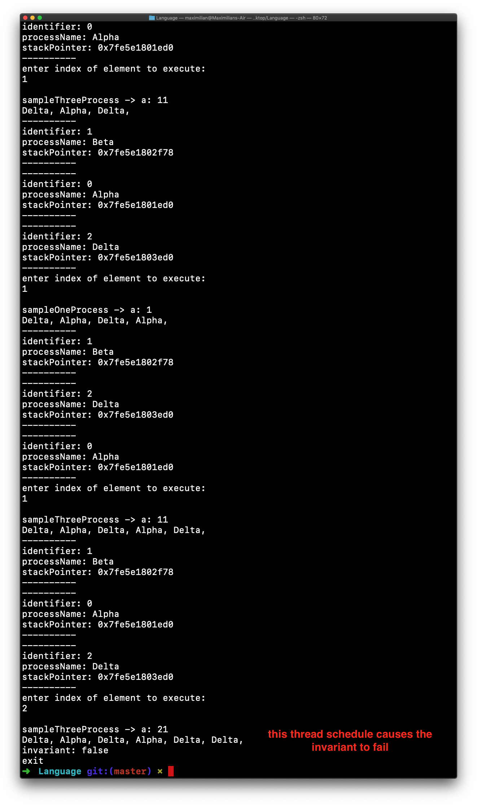

# invariant checker

countless shedules / permutation of threads exist for a given concurent program. 
some permutation may cause an invariant to fail.
this program aims to find those permutations.

![graph][graph.jpeg]

